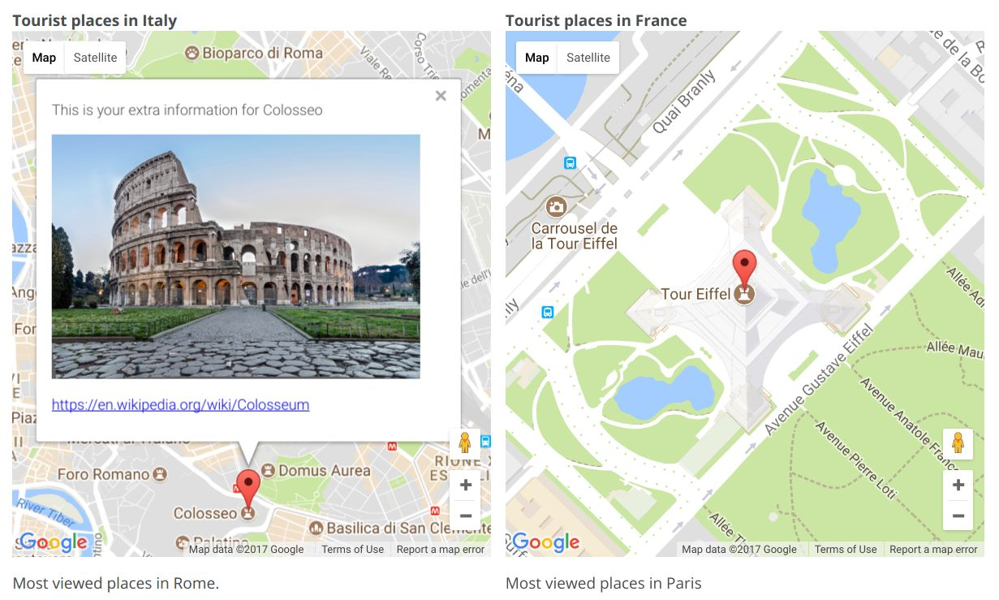

# Adapt Interactive Maps - Places

**Display interactive clickable maps on your AdaptLearning course**

 
This component displays interactive maps on a course, based on Google Maps service.

 
The component adds a list of places on the map, each place is clickable and displays a custom content.

    

<a href="https://fabiobeoni.github.io/adapt/" target="_blank">See this interactive map on a sample course</a>.

**How to install**

<ol>
 <li><a href="https://github.com/fabiobeoni/adapt-interactiveMapPlaces/archive/master.zip">download the Interactive Map - Places</a> plugin component</li>
 <li>go to your AdaptLearning Authoring tool, in the main menu select "Plugins Management / Upload Plugin"</li>
 <li>select the downloaded zip file</li>
</ol>

If you have any trouble while installing, please feel free to contact me.

This component is free under the <a href="LICENSE">Creative Commons licence agreement "Attribution-NoDerivatives 4.0 International (CC BY-ND 4.0)"</a>.

**Note about the map service**

Maps are based on Google Maps service. To create maps, you must request a <a href="https://developers.google.com/maps/documentation/javascript/get-api-key" target="_blank">Google Map API KEY</a>, then copy/paste the key
when creating the map with AdaptLearning Authoring tool.

Google Maps service has a <a href="https://developers.google.com/maps/pricing-and-plans/" target="_blank">generous free plan</a>, under a certain volume of map drawings and for free courses. Please refer to Google Maps free plan to make sure that
 fits your needs.

 

**Support the development**

If you like this component and you would like to adopt other kind of interactive maps on your course 
(like <a href="http://openlayers.org/" target="_blank">OpenLayers</a>), or having more complex interactions
on the maps,
please consider to support the development of new map components. 

If you are interested, I'm <a href="https://it.linkedin.com/in/fabio-beoni-6a7848101">available for hire</a> to develop custom map based components for AdaptLearning courses.

----------------------------
**Version number:**  1.3.1
**Adapt Framework versions:**  >= 2.0
**Author:** <a href="https://it.linkedin.com/in/fabio-beoni-6a7848101" target="_blanck">Fabio Beoni</a>
